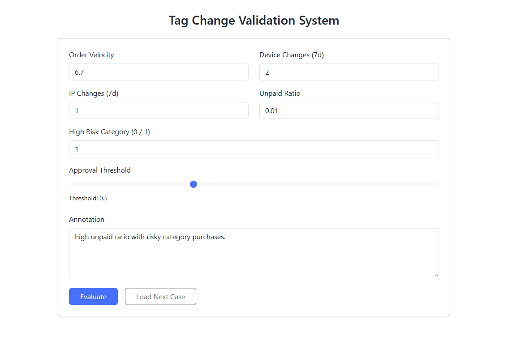

---

# 🚀 TagAssist

Hybrid ML Validation Engine for Fraud Tag Change Requests

---


---

## 📌 Overview

**TagAssist** is a hybrid behavioral + NLP validation engine designed to automatically validate fraud tag change requests in high-volume dispute queues.

The system assists investigators by scoring pending tag requests using structured behavioral signals and semantic analysis of investigator annotations, then recommending automated approval for high-confidence cases.

It is designed to reduce manual bottlenecks, stabilize SLA during fraud spikes, and preserve expert bandwidth.

---

## 🧠 The Problem

In fraud-heavy dispute queues:

* Senior investigators raise tag change requests with historically high accuracy (~90%+).
* These requests accumulate in a limited expert-review queue.
* Even high-confidence cases require manual validation.
* During fraud spikes, SLA pressure increases and backlogs compound.

The operational bottleneck is not accuracy — it is validation throughput.

Every request is treated equally, regardless of confidence level.

---

## 🎯 Objective

Build a system that:

* Validates tag change requests automatically when confidence is high
* Routes medium-confidence cases for manual review
* Rejects low-confidence cases
* Reduces review load without replacing human judgment

The goal is not to eliminate review —
it is to intelligently reduce unnecessary review.

---

## 🏗 System Architecture

```
Investigator Inputs
  ├── Structured Features (velocity, IP changes, unpaid ratio, etc.)
  └── Annotation Text

Structured Features → Behavioral Model (XGBoost)
Annotation Text → MiniLM Embedding → Text Model

           ↓
     Hybrid Weighted Scoring
           ↓
     Threshold-Based Decision Engine
           ↓
Approve | Route | Reject
```

---

## 🧩 Model Design

### Structured Behavioral Features

* Order velocity
* Device changes (7d)
* IP changes (7d)
* Unpaid order ratio
* Risk category flag

### Text Understanding

* Sentence embeddings using `all-MiniLM-L6-v2`
* Captures semantic meaning of annotations
* Handles shorthand investigator language (e.g., "order vel; card vel")

### Ensemble Strategy

Final score =

```
0.3 × Behavioral Score + 0.7 × Text Score
```

Hybrid modeling improved robustness compared to structured-only approaches.

---

## 📊 Experimental Results

On synthetic fraud-heavy validation data:

* ROC-AUC: ~0.68–0.70 (Hybrid Model)
* Demonstrated safe high-confidence filtering
* Controlled threshold tuning enabled conservative auto-approval

Even 8–15% safe auto-approval can:

* Reduce manual review volume
* Improve SLA stability during fraud spikes
* Preserve expert reviewer bandwidth

---

## 📈 Operational Impact

### Before

* Every tag change request required manual validation
* Queue congestion during fraud spikes
* High-confidence cases delayed unnecessarily

### After (with TagAssist)

* High-confidence requests auto-approved
* Medium-confidence routed to experts
* Reduced bottleneck in expert validation queue
* Improved operational stability

---

## 🖥 Live Demo

🔗 [https://tagassist.dev](https://tagassist.dev)

Features:

* Adjustable threshold
* Real-time fraud scoring
* Behavioral + NLP confidence breakdown
* Auto-approval tracking
* Session-based case history

---

## ⚙ Deployment Architecture

* Dockerized Flask application
* Gunicorn WSGI server
* Nginx reverse proxy
* DigitalOcean Droplet (2GB RAM)
* Let's Encrypt SSL (auto-renew)
* Environment-based secret management

Production hardened with:

* CPU-only Torch build
* Reverse proxy configuration
* Secure session signing
* Docker restart policy

---

## 🧠 Engineering Challenges Faced

### Infrastructure

* Transformer memory constraints on managed platforms
* Worker timeouts during model loading
* Docker image optimization
* CPU-only PyTorch configuration

### Networking

* DNS propagation debugging
* Nameserver misconfiguration
* SSL validation failures (NXDOMAIN issues)
* Reverse proxy routing setup

### Deployment

* Container lifecycle management
* Secure secret key handling
* Production environment configuration

---

## 📚 What I Learned

This project reinforced:

* Hybrid modeling strategies (structured + semantic)
* How infrastructure affects ML reliability
* Real-world deployment debugging
* DNS, SSL, reverse proxy configuration
* Production security best practices
* SLA-aware ML system design

It also highlighted that operational ML systems require as much infrastructure thinking as model thinking.

---

## ⚖ Ethical & Risk Considerations

TagAssist is designed to **assist**, not replace, investigators.

* Threshold tuning is conservative
* High-confidence auto-approval only
* Human review remains central for ambiguous cases
* Designed to reduce noise, not override expertise

---

## 🚀 Future Improvements

* SHAP-based explainability panel
* Confidence calibration curves
* Active learning feedback loop
* Logging & monitoring dashboard
* CI/CD auto-deployment pipeline
* Model retraining workflow

---

## 📌 Why This Matters

Operational ML is not about building the most complex model.

It is about:

* Reducing bottlenecks
* Preserving expert bandwidth
* Stabilizing SLA
* Deploying systems reliably

TagAssist demonstrates an end-to-end ML system built with operational awareness and production deployment discipline.

---

